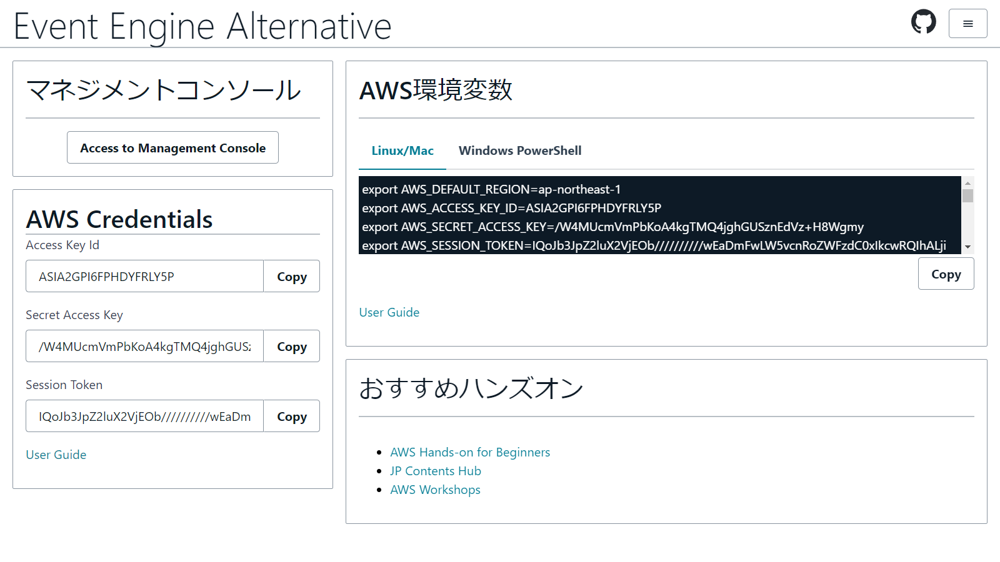
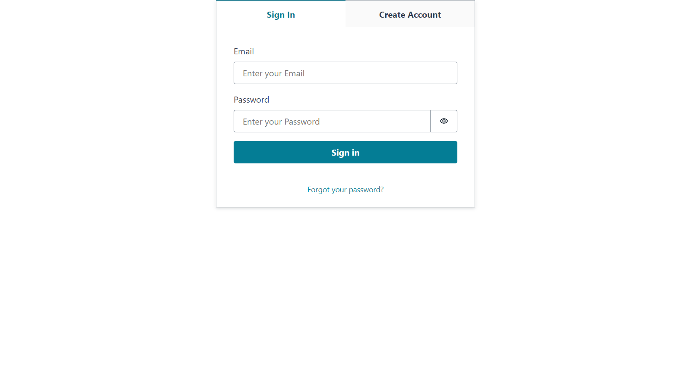
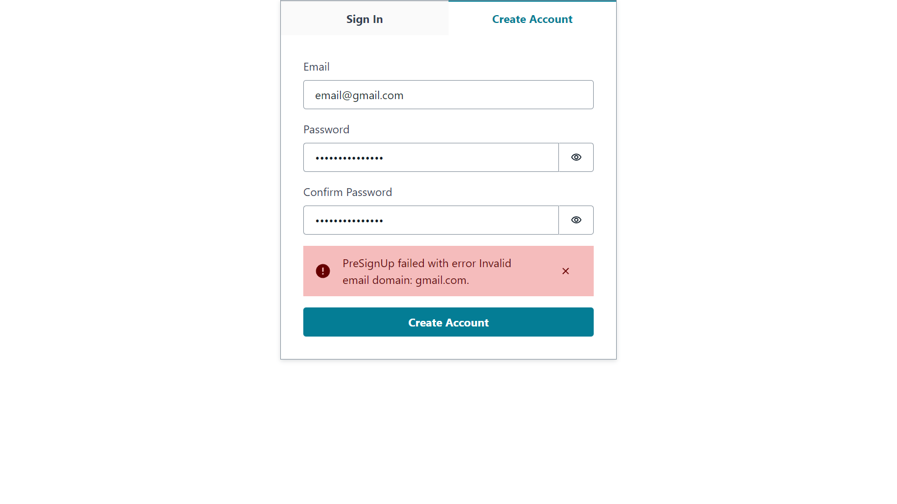
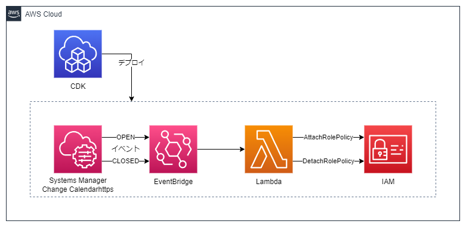

# Event Engine Alternative

イベントエンジンみたいなものを作りました。



## 特徴

* イベント参加者が自由にサインアップ可能
* サインアップできるメールアドレスのドメインを限定可能
* AWS認証情報とマネジメントコンソールへのアクセスURLを提供
* (オプション)イベント開催期間のみ権限を付与することも可能


## 仕組み


IAMユーザーではなくCognitoユーザーを使用します。

Cognitoではサインアップ時にLambdaを呼び出し、サインアップの可否を判定することができます。この機能を使ってメールアドレスのドメインをチェックします。（Amplifyのウィザードに従うと作成できます）

CognitoでサインインしたユーザーはIAMロールが割り当てられるため、一時的なAWS認証情報を保有しています。AWS認証情報があればマネジメントコンソールへのログインURLが発行できます。（[参考URL](https://docs.aws.amazon.com/ja_jp/IAM/latest/UserGuide/id_roles_providers_enable-console-custom-url.html)）

URL発行の際に使用するエンドポイントへのCORSアクセスとなるため、API GatewayとLambdaで中継しています。


## デプロイ手順

1. Amplify CLIのインストール

    ```
    npm install -g @aws-amplify/cli
    ```

1. Amplifyの初期設定

    ```
    amplify configure
    ```

    ウィザードに従い、`AdministratorAccess-Amplify`権限の持つユーザーの認証情報を登録します。

1. ソースの取得

    ```
    https://github.com/moritalous/event-engine-alt-v1.git
    cd event-engine-alt-v1/
    ```

1. プロジェクト設定

    ```
    amplify init
    ```

    手順の途中で`? Enter a comma-delimited list of allowed email domains (example: 'mydomain.com, myotherdomain.com').`と聞かれるので、メールアドレスのドメインを入力します。複数指定する場合は`,`で区切って入力します。

    ```
    ? Enter a name for the environment dev
    ? Choose your default editor: Visual Studio Code
    ? Select the authentication method you want to use: AWS profile
    ? Please choose the profile you want to use default
    ✔ Enter a comma-delimited list of allowed email domains (example: 'mydomain.com, myotherdomain.com'). · example.com
    ```

1. AWSへデプロイ

    ```
    amplify push
    ```

    以下のリソースが作成されます。

    | Category | Resource name | Operation | Provider plugin |
    | --- | --- | --- | --- |
    | Api | api70c8d7e0 | Create | awscloudformation |
    | Auth | eventenginealtbcc6920b | Create | awscloudformation |
    | Function | eventenginealt5e203a7f | Create | awscloudformation |
    | Function | eventenginealtbcc6920bPreSignup | Create | awscloudformation |


1. 画面の起動(ローカル環境)

    ```
    npm install
    npm start
    ```

    `localhost:3000`にアクセスします。

    * サインイン画面。サインアップも可能

    

    * 指定したドメイン以外のメールアドレスでサインアップを試みるとエラー

    

    * サインアップが完了するとホーム画面へ遷移

    

1. 画面の公開（ホスティング）

    ```
    amplify add hosting
    amplify publish
    ```


## 付与するIAM権限の変更

サインインしたユーザーに付与するIAM権限は`amplify/backend/awscloudformation/override.ts`にて変更が可能です。

インラインポリシーの場合は`authRole.policies`の部分を変更します。

```
authRole.policies = [
    ...basePolicies,
    {
        policyName: "amplify-permissions-custom-resources",
        policyDocument: {
            Version: "2012-10-17",
            Statement: [
                {
                    Resource: "*",
                    Action: ["*"],
                    Effect: "Allow",
                },
            ],
        },
    },
];
```

AWS管理ポリシーの場合は`authRole.managedPolicyArns`の部分を変更します。

```
authRole.managedPolicyArns = [
    ...baseManagedPolicy,
    'arn:aws:iam::aws:policy/ReadOnlyAccess'
]
```

## (オプション)イベント期間のみ自動で権限付与

イベント開催期間をカレンダーに事前に登録し、イベント開始時刻に権限を付与しイベント終了時刻に権限を削除することができます。

Amplifyとは独立したCDKで構築します。




1. カレンダーの作成
    
    [AWS Systems Manager 変更カレンダー](https://ap-northeast-1.console.aws.amazon.com/systems-manager/change-calendar)にアクセスし、変更カレンダーを作成します。（CDKでは`event-engine-alt-schedule`という名前を指定しています）

1. IAM権限の追加

    `amplify configure`で作成したユーザーに付与されている`AdministratorAccess-Amplify`ではCDKのデプロイができないため、`AdministratorAccess`権限を追加してください。

1. CDKのインストール

    ```
    npm install -g aws-cdk
    ```

1. CDKプロジェクトディレクトリへ移動と依存ライブラリーのインストール

    ```
    cd calendar-cdk/
    npm install
    ```

1. CDKの初期設定

    未実施の場合のみ実行

    ```
    cdk bootstrap
    ```

1. 対象のロール、権限を変更

    `calendar-cdk/lib/cdk-stack.ts`を修正します。

    * `targetRoleName`

        Cognitoでサインイン後のユーザーに付与するIAMロールを指定します。ロール名は`amplify/team-provider-info.json`の`dev`.`AuthRoleName`で確認できます。

    * `targetPolicyArn`

        付与したいポリシーのARNを指定します。初期状態では`AdministratorAccess`を付与しています。

1. AWSへデプロイ

    ```
    cdk deploy
    ```

    以下のリソースが作成されます。

    | Resources |Description |
    | --- | --- |
    | AWS::Events::Rule | スケジュールが"OPEN"になった際に実行されるイベント |
    | AWS::Lambda::Permission | 
    | AWS::IAM::Role |
    | AWS::IAM::Policy |
    | AWS::Lambda::Function | EventBridgeから呼び出されるLambda関数
    | AWS::Events::Rule | スケジュールが"CLOSED"になった際に実行されるイベント |
    | AWS::Lambda::Permission |
